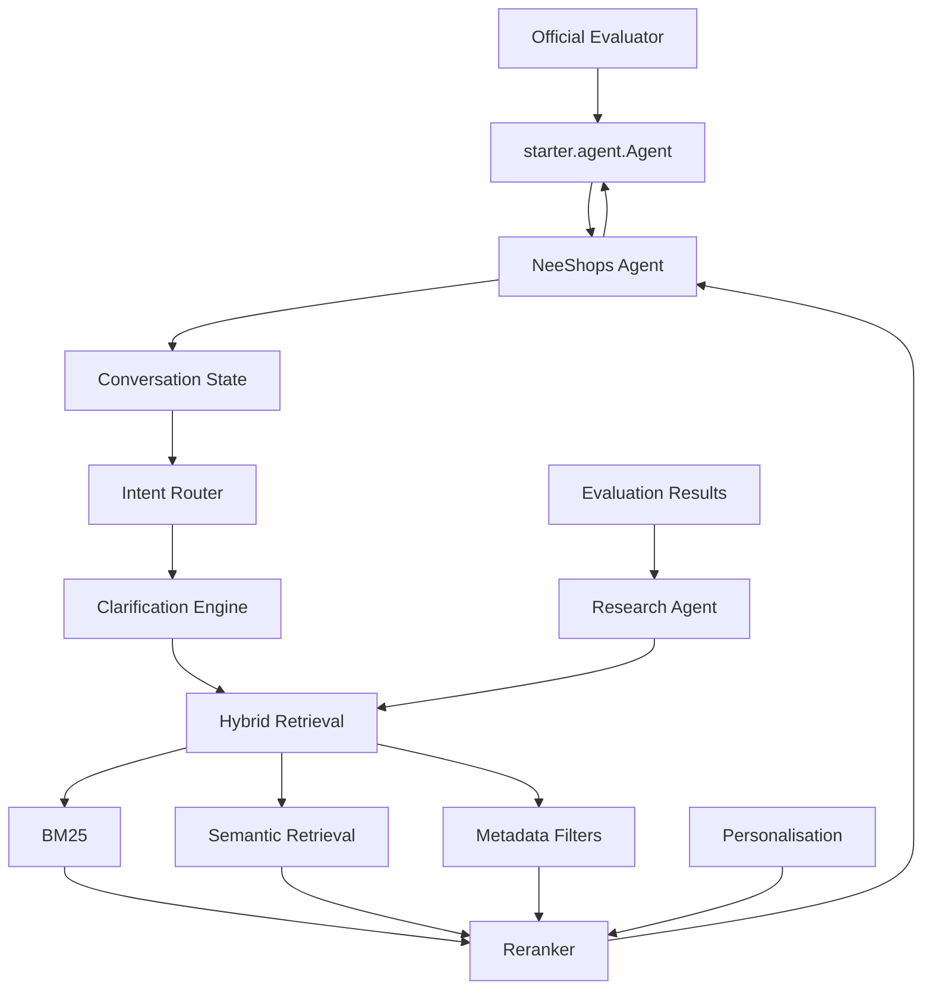

# Architecture

## Pipeline



## Layering

```text
starter/agent.py            (frozen shape the evaluator imports — kept tiny)
        ↓ delegates to
neeshops/agent.py            (NeeShopsAgent — orchestration only)
        ↓ calls
neeshops/conversation/       (state, intent routing, constraint extraction, clarification)
neeshops/retrieval/          (BM25, semantic [stub], metadata filters, hybrid merge)
neeshops/ranking/            (heuristic reranker, LLM reranker [stub])
neeshops/personalization/    (soft profile-based ranking boost)
neeshops/research/           (experiments, runner, results store, optimizer)
neeshops/models/             (Product, Recommendation, ConversationState, UserProfile)
neeshops/config/             (settings.py + default_strategy.json — the one
                               place retrieval/ranking/clarification weights live)
neeshops/utils/               (logging, tokenization, catalog loading)
```

## Module responsibilities, in plain English

- **`starter/agent.py`** — the only file the official evaluator imports.
  Must keep the exact `Agent.reset(...)` / `Agent.respond(...)` shape. It
  does nothing except construct a `NeeShopsAgent` and delegate — if this
  file grows beyond ~30 lines, logic has leaked in that belongs in
  `neeshops/`.

- **`neeshops/agent.py` — `NeeShopsAgent`** — orchestrates one turn: pull
  session state, extract constraints, detect buying/browsing, retrieve,
  filter, decide whether to ask a clarifying question, rank, record what
  was shown, return a response. It calls into every other module below but
  implements none of their logic itself.

- **`neeshops/conversation/`** — everything about *understanding the
  conversation*: `state.py` (the session store + intent-override /
  no-preference semantics), `intent.py` (buying vs. browsing),
  `constraints.py` (free text → structured constraint updates),
  `clarification.py` (should we ask, recommend, or both).

- **`neeshops/retrieval/`** — everything about *finding candidates*:
  `base.py` (the `Retriever` interface + `Candidate`), `bm25.py` (SQLite
  FTS5 keyword search — the working baseline retriever), `semantic.py`
  (embedding search — interface only for Stage 1), `filters.py`
  (structured attribute/budget filtering), `candidate_merge.py`
  (weighted score fusion), `hybrid.py` (the router that ties BM25 +
  semantic + config weights together — this is what the agent actually
  calls).

- **`neeshops/ranking/`** — everything about *ordering candidates and
  explaining why*: `base.py` (the `Ranker` interface), `heuristic.py`
  (Stage-1 working reranker — blends retrieval score with a
  personalization boost, attaches a human-readable reason),
  `llm_reranker.py` (interface stub, gated behind a feature flag).

- **`neeshops/personalization/`** — turns the organiser's anonymised
  profile into a *soft* ranking signal. Never a hard filter — an explicit
  in-conversation request always wins.

- **`neeshops/research/`** — the controlled experimentation framework:
  `experiment.py` (a named, config-only diff against a declared
  `SAFE_PARAMETERS` allowlist — never a code change),
  `experiment_runner.py` (runs one experiment's config through a supplied
  evaluation function and records accept/reject), `results_store.py`
  (append-only experiment history), `optimizer.py` (Stage-1 grid/random
  search that proposes new safe parameter values).

- **`neeshops/models/`** — plain data schemas (`Product`,
  `Recommendation`, `ConversationState`, `UserProfile`) with no behaviour,
  so every other module can depend on the shape without pulling in logic.

- **`neeshops/config/`** — `default_strategy.json` holds every tunable
  weight; `settings.py` loads it plus `.env`-derived settings/feature
  flags. No module should hardcode a retrieval weight or limit — it reads
  it from here.

- **`neeshops/utils/`** — structured JSON-line logging, a dependency-free
  tokenizer, and catalog-loading.

- **`neeshops/experimental/`** — placeholder for future, out-of-scope
  visual AI features (image/video search, media authenticity). Not wired
  into the competition Agent path at all — see its README.

- **`evaluator/`** — the organiser's official evaluator, vendored as-is
  from `TechJam2026/techjam-conversational-search`. Not authored by us;
  never modify it — see `docs/neeshops/COMPETITION_NOTES.md`.

- **`frontend/`** — the demo prototype, entirely decoupled from the Agent.
