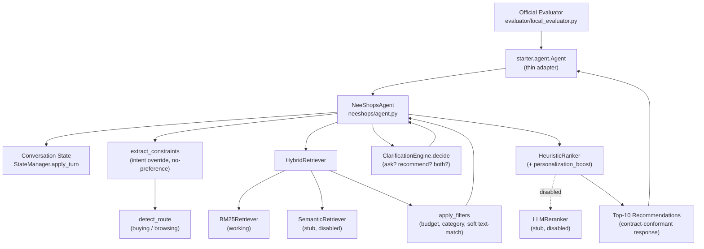
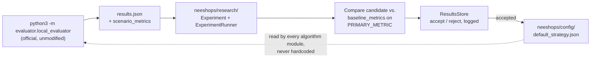

# NeeShops — Project Overview

Read this first. For requirements, see
`docs/neeshops/TRACK4_REQUIREMENTS.md`; for module detail, see
`docs/neeshops/FOLDER_GUIDE.md`; for interfaces, see
`docs/neeshops/INTEGRATION_CONTRACTS.md`; for the job split, see
`docs/neeshops/TEAM_WORKSTREAMS.md`.

## Project goal

Build a self-improving conversational shopping Agent that finds the
hidden target product as early and as highly ranked as possible, within
10 turns, on the official TechJam Track 4 evaluator — while keeping the
official participant contract untouched.

## Current architecture



Call order as actually implemented in `neeshops/agent.py::respond()`:
extract constraints → detect route → retrieve (`HybridRetriever`) → apply
filters (if catalog loaded) → clarification decision → apply turn to state
→ rank (only if `should_recommend`) → build response.

### Research / evaluation loop



`neeshops/research/` never imports `evaluator/` directly — the coupling
lives in `scripts/run_experiment.py`/`scripts/evaluate.py` only.

## Project status

Evidence-based — nothing here is marked `FUNCTIONAL` or `VALIDATED`
without a cited test or run.

| Area | Status | Current implementation | Next milestone | Owner |
|---|---|---|---|---|
| Official contract adapter (`starter/agent.py`) | **FUNCTIONAL** | Response shape verified byte-for-byte against `docs/agent_api_contract.json`; `tests/test_agent_contract.py` (3 tests) passes | Run against real catalog (M1) | P5 |
| Conversation state / Intent Override / no-preference | **FUNCTIONAL** | `tests/test_state.py` (4), `tests/test_intent_override.py` (4) pass | Extend field extraction coverage | P1 |
| Buying/Browsing routing | **SCAFFOLDED** | Heuristic keyword scorer, sticky route; no dedicated test yet, no evaluator-measured accuracy | Add per-scenario routing tests; measure vs. 40/40/15/5 mix (needs M1) | P1 |
| Clarification engine | **FUNCTIONAL** | Rule-based ask/recommend decision; dead-end bug (small-but-nonzero pool → neither question nor recommendation) fixed and exercised by `tests/test_intent_override.py` | Measure MTTC impact once evaluator runs (M1) | P1 |
| BM25 retrieval | **FUNCTIONAL** (fixture-tested) | `tests/test_retrieval.py` (3) passes against a 3-row fixture catalog matching the real schema; **never run against the real 50k catalog** | Install real catalog, confirm index builds and retrieves sensibly | P2 |
| Semantic retrieval | **NOT STARTED** | Interface stub, `NotImplementedError`, disabled by default flag | Implement (P2-D3) | P2 |
| Metadata filters | **SCAFFOLDED** | Budget/category filter against real fields; material/color/brand are soft text-containment fallbacks (real catalog lacks discrete fields) | Extend for size/style; measure precision impact | P2 |
| Hybrid retrieval merge | **FUNCTIONAL** | `candidate_merge.merge_weighted()` unit-testable, exercised in end-to-end smoke test | Re-verify once semantic retrieval is real | P2 |
| Heuristic ranking | **FUNCTIONAL** | `tests/test_ranking.py` (3, added this audit) — ordering, `top_k`, and soft-personalisation-never-overrides verified | Measure MRR delta vs. retrieval-only order (M4) | P3 |
| LLM reranking | **NOT STARTED** | Interface stub, disabled by default flag, no fallback wiring in `neeshops/agent.py` yet | Implement + wire fallback (P3-D3) | P3 |
| Personalisation | **FUNCTIONAL** | Keyword-tag-overlap boost; soft-signal behaviour explicitly tested | Consider a learned signal later (not required for Track 4) | P3 |
| Research/experiment framework | **FUNCTIONAL** | `tests/test_research.py` (5, added this audit) — safe-parameter enforcement, strategy building, accept/reject wiring, results persistence, all pass without a real catalog | Run a real experiment cycle once M1 is done | P4 |
| Dev/holdout split tooling | **SCAFFOLDED** | `scripts/create_dev_split.py` implemented, never executed against the real 200-session set in this environment | Run once catalog + public set are both installed | P4 |
| Official evaluator integration (mechanical) | **VALIDATED** | A full 10-turn session was run through the real `evaluator.local_evaluator.evaluate()` against a schema-accurate fixture catalog — completed with zero exceptions and a valid `results.json` (see Current score below) | Run against the real catalog for real scores (M1) | P5 |
| Official evaluator integration (scored) | **NOT VALIDATED** | Real 50k catalog + 200 public sessions not installed in this environment | Install catalog, run `python scripts/evaluate.py` | P4 |
| Frontend prototype | **SCAFFOLDED / OPTIONAL** | Static clickable HTML demo, fully decoupled from the Agent | Not a scored deliverable — see "Frontend classification" below | P5 (only if ahead of schedule) |

## Current score

- **Organiser baseline** (official, `docs/baseline_results.json`,
  measured by the organiser on the public set):
  ```text
  Hit Rate@10:    0.125
  MRR:            0.068034
  MTTC:           9.81
  Efficiency:     0.119
  TechnicalScore: 0.10671
  ```
- **Current NeeShops score**: **not yet measured.** The real
  `data/catalog.jsonl` (50,000 products, downloaded from the organiser's
  GitHub Release) is not installed in this development environment, so
  `python3 -m evaluator.local_evaluator` / `python scripts/evaluate.py`
  have not been run against real data. **Do not treat any number in this
  repository as a current score until P4 records one here with a date and
  configuration, per M1.**
- What *has* been verified (mechanical integration, not a score): a
  synthetic 3-product, schema-accurate fixture catalog was built, and one
  full 10-turn session was driven through the real, unmodified
  `evaluator.local_evaluator.evaluate()` via `starter.agent.Agent` — it
  completed with no exceptions and wrote a schema-valid `results.json`.
  This proves the pipeline is wired correctly end-to-end; it says nothing
  about retrieval/ranking quality on real data.

## Immediate milestone

1. **Reproduce the organiser baseline** — install the real catalog
   (`data/README.md`), run `python3 -m evaluator.local_evaluator`,
   confirm the numbers land near `docs/baseline_results.json`. (P4, blocks
   everything else that claims a measured delta.)
2. **Keep the official evaluator working** — `evaluator/` stays
   byte-identical to `upstream/main` forever; verify with
   `git diff upstream/main -- evaluator/` before every merge to `main`.
3. **Establish internal development/holdout evaluation** —
   `scripts/create_dev_split.py` exists; run it once the public set is
   confirmed installed, and use `data/dev_split.jsonl` (not all 200
   sessions) for day-to-day experiment iteration.
4. **Begin measurable improvements** — only after 1–3, via
   `neeshops/research/` (P4) proposing config changes and P1/P2/P3 landing
   real feature work, each verified against the evaluator, never assumed.

## Frontend classification

The `frontend/` prototype is **OPTIONAL DEMO / PRODUCT VISION**, not core
Track 4 engineering. Track 4 is judged via backend/headless execution; the
official Agent and evaluator are fully usable with `frontend/` deleted
entirely. No workstream is primarily responsible for it — P5 may wire a
minimal developer/demo view *only if* core engineering (M1–M6) is ahead of
schedule. See `frontend/README.md`.

## Future / experimental (explicitly out of scope for Track 4)

- **Visual product search** (image/video → identify characteristics →
  similar products)
- **AI media detection** (uploaded media → AI-generated likelihood
  estimate)

These are **not part of the official Track 4 implementation** — Track 4's
scope is text catalogs, structured metadata, and text dialogs only
(multimodal processing is out of scope). They exist only as documented
ideas in `neeshops/experimental/README.md`, have zero import dependency
from `neeshops/agent.py` or anything it depends on, and must not be
scaffolded further without explicit approval that they won't complicate
the official Agent path.
