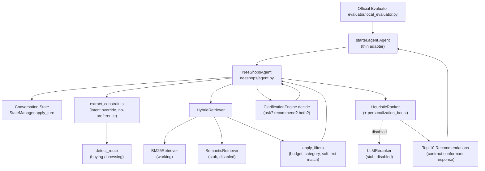
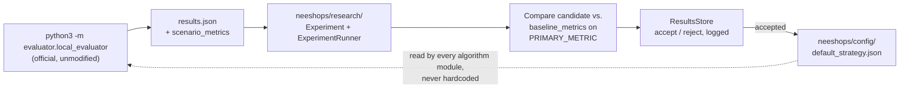

# NeeShops — Project Overview

New to the project? Read `docs/neeshops/BEGINNER_START_HERE.md` first,
then follow `docs/neeshops/TWO_DAY_FULL_SCOPE_PLAN.md` and your section of
`docs/neeshops/WORKSTREAM_QUICKSTARTS.md`. Those guides preserve the full
scope and turn this reference material into ordered beginner tasks.

For requirements, see
`docs/neeshops/TRACK4_REQUIREMENTS.md`; for module detail, see
`docs/neeshops/FOLDER_GUIDE.md`; for interfaces, see
`docs/neeshops/INTEGRATION_CONTRACTS.md`; for the job split, see
`docs/neeshops/TEAM_WORKSTREAMS.md`.

## Project goal

Build a self-improving conversational shopping Agent that finds the
hidden target product as early and as highly ranked as possible, within
10 turns, on the official TechJam Track 4 evaluator — while keeping the
official participant contract untouched.

## Current architecture



Call order as actually implemented in `neeshops/agent.py::respond()`:
extract constraints → detect route → retrieve (`HybridRetriever`) → apply
filters (if catalog loaded) → clarification decision → apply turn to state
→ rank (only if `should_recommend`) → build response.

### Research / evaluation loop



`neeshops/research/` never imports `evaluator/` directly — the coupling
lives in `scripts/run_experiment.py`/`scripts/evaluate.py` only.

## Project status

Evidence-based — nothing here is marked `FUNCTIONAL` or `VALIDATED`
without a cited test or run.

| Area | Status | Current implementation | Next milestone | Owner |
|---|---|---|---|---|
| Official contract adapter (`starter/agent.py`) | **FUNCTIONAL** | `tests/test_agent_contract.py` uses a searchable fixture, requires non-empty recommendations, and verifies exact allowed top-level/item fields | Keep schema test green through integration | P5 |
| Conversation state / Intent Override / no-preference | **FUNCTIONAL** | `tests/test_state.py` (4), `tests/test_intent_override.py` (4) pass | Extend field extraction coverage | P1 |
| Buying/Browsing routing | **SCAFFOLDED** | Heuristic keyword scorer, sticky route; no dedicated test yet, no evaluator-measured accuracy | Add per-scenario routing tests; measure vs. 40/40/15/5 mix (needs M1) | P1 |
| Clarification engine | **FUNCTIONAL** | Rule-based ask/recommend decision; dead-end bug (small-but-nonzero pool → neither question nor recommendation) fixed and exercised by `tests/test_intent_override.py` | Measure MTTC impact once evaluator runs (M1) | P1 |
| BM25 retrieval | **FUNCTIONAL** | Fixture tests pass; official 50,000-row catalog checksum/row count validated; disk index built; real smoke queries returned 200 candidates | Measure candidate recall and restore official field weighting deliberately | P2 |
| Semantic retrieval | **NOT STARTED** | Interface stub, `NotImplementedError`, disabled by default flag | Implement (P2-D3) | P2 |
| Metadata filters | **SCAFFOLDED** | Budget/category filter against real fields; material/color/brand are soft text-containment fallbacks (real catalog lacks discrete fields) | Extend for size/style; measure precision impact | P2 |
| Hybrid retrieval merge | **FUNCTIONAL** | `candidate_merge.merge_weighted()` unit-testable, exercised in end-to-end smoke test | Re-verify once semantic retrieval is real | P2 |
| Heuristic ranking | **FUNCTIONAL** | `tests/test_ranking.py` (3, added this audit) — ordering, `top_k`, and soft-personalisation-never-overrides verified | Measure MRR delta vs. retrieval-only order (M4) | P3 |
| LLM reranking | **NOT STARTED** | Interface stub, disabled by default flag, no fallback wiring in `neeshops/agent.py` yet | Implement + wire fallback (P3-D3) | P3 |
| Personalisation | **FUNCTIONAL** | Keyword-tag-overlap boost; soft-signal behaviour explicitly tested | Consider a learned signal later (not required for Track 4) | P3 |
| Research/experiment framework | **FUNCTIONAL** | `tests/test_research.py` (5, added this audit) — safe-parameter enforcement, strategy building, accept/reject wiring, results persistence, all pass without a real catalog | Run a real experiment cycle once M1 is done | P4 |
| Dev/holdout split tooling | **FUNCTIONAL** | `scripts/create_dev_split.py` implemented for deterministic 160/40 output | Record dataset identity in every comparison | P4 |
| Official evaluator integration (mechanical) | **VALIDATED** | Full 200-session public evaluator completed without exceptions on the official catalog on 2026-08-28 | Preserve through every merge | P5 |
| Official evaluator integration (scored) | **VALIDATED (initial)** | Current default deterministic NeeShops candidate measured on all 200 public sessions; see Current score | Establish comparable dev-split baseline and run experiments | P4 |
| Frontend prototype | **SCAFFOLDED / OPTIONAL** | Static clickable HTML demo, fully decoupled from the Agent | Not a scored deliverable — see "Frontend classification" below | P5 (only if ahead of schedule) |

## Current score

- **Organiser baseline** (official, `docs/baseline_results.json`,
  measured by the organiser on the public set):
  ```text
  Hit Rate@10:    0.125
  MRR:            0.068034
  MTTC:           9.81
  Efficiency:     0.119
  TechnicalScore: 0.10671
  ```
- **Current deterministic NeeShops initial score** (measured 2026-08-28 on
  all 200 public sessions, official 50,000-product release catalog, default
  strategy, semantic retrieval and LLM reranking disabled):
  ```text
  Hit Rate@10:    0.285
  MRR:            0.188581
  MTTC:           8.55
  Efficiency:     0.245
  TechnicalScore: 0.248074
  ```
  Scenario Hit Rate@10 was Buying `0.3875`, Browsing `0.2375`, Intent
  Override `0.1`, and Boundary `0.4`. This is a current-candidate measurement,
  **not** a reproduction of the organizer's original weak-starter baseline.
  Generated `results.json` is gitignored; rerun the documented command to
  reproduce it after a clean catalog setup.

## Immediate milestone

1. **Establish comparable baselines** — reproduce the organizer's published
   weak starter from a clean upstream checkout, and separately record the
   current NeeShops strategy on the same development split. Do not expect the
   modified stateful/hybrid/ranked NeeShops Agent to equal the original
   stateless weighted-BM25 score.
2. **Keep the official evaluator working** — `evaluator/` stays
   byte-identical to `upstream/main` forever; verify with
   `git diff upstream/main -- evaluator/` before every merge to `main`.
3. **Establish internal development/holdout evaluation** —
   `scripts/create_dev_split.py` exists; run it once the public set is
   confirmed installed, and use `data/dev_split.jsonl` (not all 200
   sessions) for day-to-day experiment iteration.
4. **Begin measurable improvements** — only after 1–3, via
   `neeshops/research/` (P4) proposing config changes and P1/P2/P3 landing
   real feature work, each verified against the evaluator, never assumed.

## Frontend classification

The `frontend/` prototype is **OPTIONAL DEMO / PRODUCT VISION**, not core
Track 4 engineering. Track 4 is judged via backend/headless execution; the
official Agent and evaluator are fully usable with `frontend/` deleted
entirely. No workstream is primarily responsible for it — P5 may wire a
minimal developer/demo view *only if* core engineering (M1–M6) is ahead of
schedule. See `frontend/README.md`.

The one exception is the **Agent Trace Viewer** (P5-D6, see
`docs/neeshops/TEAM_WORKSTREAMS.md`) — it reuses the frontend's existing
"Agent Run Inspector" mockup wired to a real session's logs. It's a demo
tool, not the frontend becoming a real workstream: it's read-only, has no
effect on the scored Agent, and is a submission-polish (M7) item, not a
prerequisite for M0–M6.

## Stretch goals

Optional, judge-visible extras anyone can pick up once their core
deliverables are done — see "Stretch Goals / Bonus Backlog" at the end of
`docs/neeshops/TEAM_WORKSTREAMS.md`. Nothing there is required for a
working submission.

## Future / experimental (explicitly out of scope for Track 4)

- **Visual product search** (image/video → identify characteristics →
  similar products)
- **AI media detection** (uploaded media → AI-generated likelihood
  estimate)

These are **not part of the official Track 4 implementation** — Track 4's
scope is text catalogs, structured metadata, and text dialogs only
(multimodal processing is out of scope). They exist only as documented
ideas in `neeshops/experimental/README.md`, have zero import dependency
from `neeshops/agent.py` or anything it depends on, and must not be
scaffolded further without explicit approval that they won't complicate
the official Agent path.
